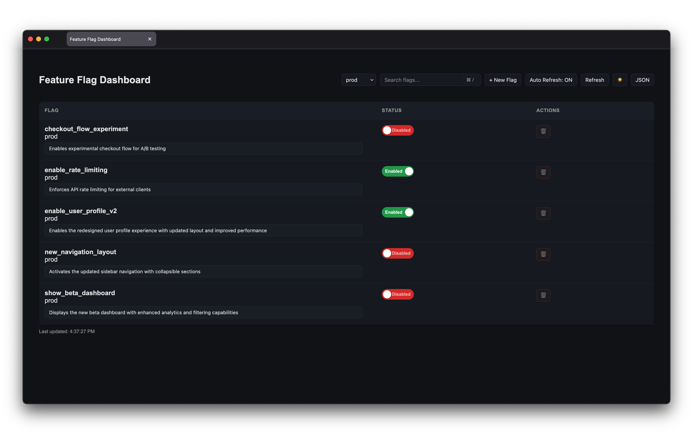

# Feature Flags Flask Application


[](https://dl.circleci.com/status-badge/redirect/gh/Jordan-Cartwright/circleci-feature-flags-app/tree/main)

This is a demo flask application using a basic configuration and a database.



To checkout a fully deployed version of this application checkout this link:

- [`feature-flags-web.onrender.com`](https://feature-flags-web.onrender.com)

## Getting Started

These instructions will get you a copy of the project up and running on your local machine for
development and testing purposes.

## Prerequisites

- Python 3.14

## Installation

Install dependencies with:

```bash
make install
```

## Running Tests

```bash
make test
```

## Docker

### Building the images locally

These steps can run on all supported architectures that the python image runs on.

1. Clone this GitHub repository

    ```bash
    git clone git@github.com:Jordan-Cartwright/circleci-feature-flags-app.git
    ```

2. Build images and tag them appropriately

    ```bash
    docker build -t feature-flags-web:latest .
    ```

You should now have a version of the docker image available for use locally.
